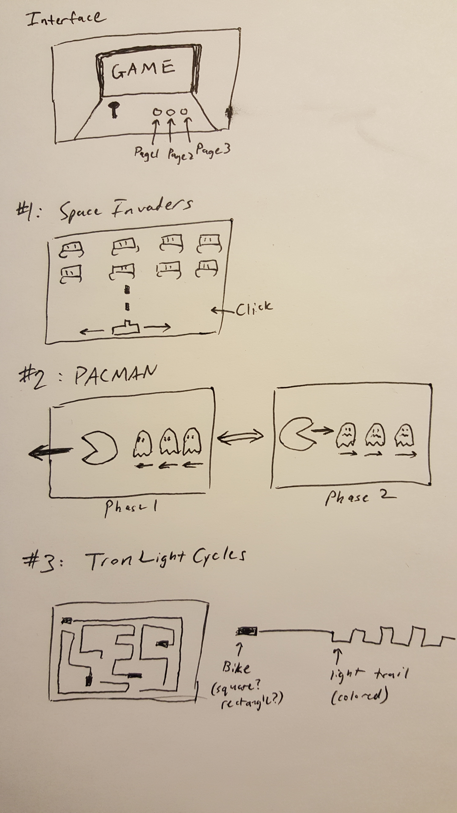

# DotW-Final

### Interface Page

The interface page on which the visitor can access the other pages will be based on an arcade cabinet. It will feature a screen and three buttons. I may add an image of a joystick to help the page resemble an arcade cabinet, though it will not do anything in terms of interactivity. Hovering over each button will display the game on the screen (interactivity). Clicking on the button will direct the visitor to the corresponding page. Each page is about a specific retro arcade game, namely Space Invaders, Pacman, and Tron.

### Drawing 1: Space Invaders

This page will feature the game Space Invaders. It will include a tank (or laser cannon) on the bottom that moves by itself left and right. There will be some aliens on the top of the screen. Clicking anywhere on the page will make the tank shoot a laser projectile (interactivity). The projectile can collide with the aliens and cause them to die/disappear.

### Drawing 2: Pacman

This page will feature the game Pacman. There are two phases in this animation. Phase 1 involves Pacman running right to left from a group of ghosts. They continue running until all entities are off screen. Then, Phase 2 starts where Pacman is chasing the group of ghosts from left to right after eating a Power Pellet. They continue running until all entities are off screen. Then, Phase 1 restarts where Pacman is being chased by the ghosts.

### Drawing 3: Tron Light Cycles

This page will feature the game Tron Light Cycles. There will be multiple bikes moving around the screen randomly. They each leave a light trail like in the game. However, in this animation/simulation, colliding with the light trail does not destroy the biker. They will continue moving around the screen, coloring it with their light trails.

### Sketch

GitHub rotates the image for some reason.

